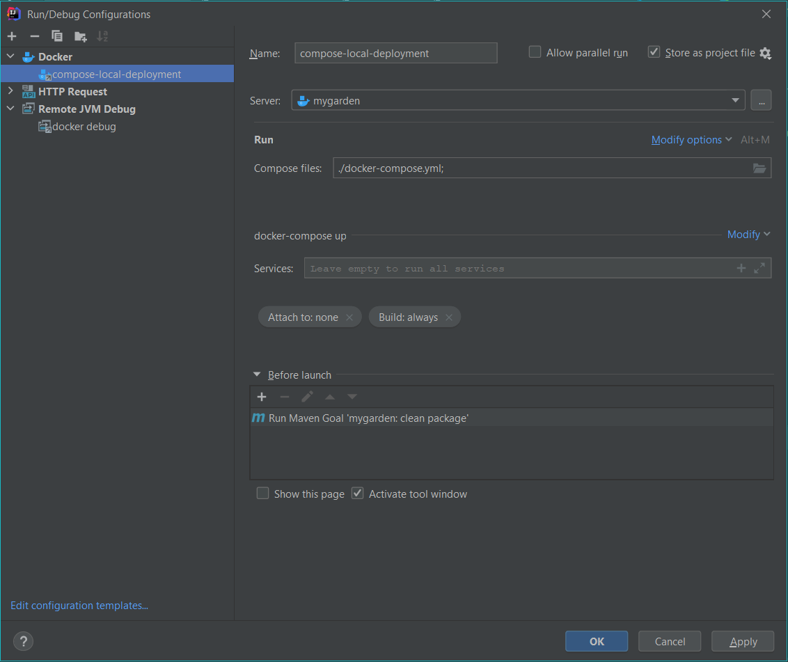

# MyGarden

	
Applications multi-tiers (AMT)

Haute École d'Ingénierie et Gestion du Canton du Vaud


---------------------------------------------
# Logo


---------------------------------------------

# Description


This application is part of the lab project for the course unit AMT. The project consists in the development of a Multi-tier app of an e-commerce. To be specific the e-commerce is a vegetable and fruit selling application.

---------------------------------------------


# License 


Copyright (c) 2021-2022 the original author or authors.

MIT License

Permission is hereby granted, free of charge, to any person obtaining a copy
of this software and associated documentation files (the "Software"), to deal
in the Software without restriction, including without limitation the rights
to use, copy, modify, merge, publish, distribute, sublicense, and/or sell
copies of the Software, and to permit persons to whom the Software is
furnished to do so, subject to the following conditions:

The above copyright notice and this permission notice shall be included in all
copies or substantial portions of the Software.

THE SOFTWARE IS PROVIDED "AS IS", WITHOUT WARRANTY OF ANY KIND, EXPRESS OR
IMPLIED, INCLUDING BUT NOT LIMITED TO THE WARRANTIES OF MERCHANTABILITY,
FITNESS FOR A PARTICULAR PURPOSE AND NONINFRINGEMENT. IN NO EVENT SHALL THE
AUTHORS OR COPYRIGHT HOLDERS BE LIABLE FOR ANY CLAIM, DAMAGES OR OTHER
LIABILITY, WHETHER IN AN ACTION OF CONTRACT, TORT OR OTHERWISE, ARISING FROM,
OUT OF OR IN CONNECTION WITH THE SOFTWARE OR THE USE OR OTHER DEALINGS IN THE
SOFTWARE.

---------------------------------------------
# Project Environment

### IDE

We will be using IntelliJ IDEA Ultimate 2021.1.2

### Platform

The app is going to be developed in Spring. Spring consists of a set of services, APIs, and protocols that provide the functionality for developing multitiered, Web-based applications.


### Database

The app use MySql for the database.

### Reverse proxy

Reverse Proxy will run in Debian 11 - Ngix.

### Linux Distribution

Debian 11

### Front-end choice

We choose to use the following layout for the Front-end of the app:

[This is an external link to the layout's ZIP's download] (https://www.free-css.com/free-css-templates/page267/jof)


---------------------------------------------
# Build and Run

Make sure Maven is installed and on the PATH.

You must have docker installed and running

The java source is Java 1.8+ so any JDK 1.8 or later will work. However, in order to generate the javadoc and UML diagrams the JDK version must be *strictly 1.8*.

There is no need to configure specific run configurations if you use intelliJ, there are predefined xml config files under ./runConfiguration.



* It will execute those maven goals clean and package
* It will execute a docker compose file wich will pull two images from the hub : tomcat:9 and mysql
  * your packaged .war file will be transported into the tomcat webapps folder
* after execution you will be able to access the app via http://localhost:8080/

Before running the docker file you will need to copy the .env.example into .env and customise the values if needed.  
You will also need to copy the `application.properties.example` into `application.properties` inside `src/main/resources/` and insert your s3 credentials.
Once done you should follow the [Readme to configure the login microservice](./amt-login-microservice/README.md) and you should be ready to go.

# Project Structure

apps

- presentation using a graphic user interface in a web page
- Main class
- application properties in resource folder

load database

- the database is loaded by using the Bean API

unit tests

- jUnit for running units tests

core

- use case controllers, model, and persistence

infrastructure

- general infrastructure issues, e.g., roles

persistence

- repository implementation (JPA, spring data)```

---------------------------------------------
# Architecture

The main architectural style is Onion.

### Design Pattern

The pattern that is foing to be used is the MVC Pattern. MVC Pattern stands for Model-View-Controller Pattern. This pattern is used to separate application's concerns.

Model - Model represents an object carrying data. It can also have logic to update controller if its data changes.

View - View represents the visualization of the data that model contains.

Controller - Controller acts on both model and view. It controls the data flow into model object and updates the view whenever data changes. It keeps view and model separate.


---------------------------------------------
# References and bibliography

