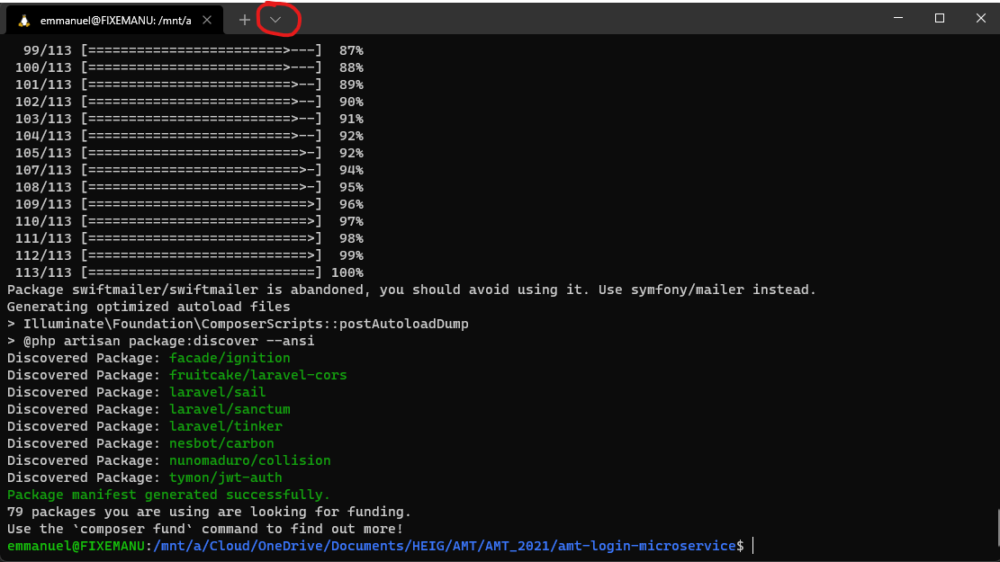

# Login api
This app is a Login api that gives a jwt token if given credentials are correct.

## Available routes
See the openAPI [documentation file](./openapiDoc.yaml)

## Default user
username: mygarden  
password: 1234  
role: admin

You can change the default user inside [seeds](./database/seeders/DatabaseSeeder.php) before running the `php artisan migrate --seed or php artisan db:seed` or by adding a new user into the database by hand.

# First run
Before executing the docker file for the first time you must run the following command from amt-login-microservice root directory: 
```
docker run --rm -u "$(id -u):$(id -g)" -v $(pwd):/var/www/html -w /var/www/html laravelsail/php81-composer:latest composer install --ignore-platform-reqs
```  

If you are using windows you have  to execute this command via the WSL terminal. To do so start a new terminal and select the drop down arrow and select your  chosen subsystem.
Navigate to the location of your project and go into the following folder `amt-login-microservice`. Now you can paste the previous command.



That command is going to create a vendor directory containing all necessary files to run the docker environment.

Once first step done we need to install and configure all dependencies
* Run docker-compose from your project root directory
* open shell inside docker `docker exec -it -u sail login_microservice /bin/bash`
* create .env file `envsubst < .env.example > .env`
* install dependecies `composer install`
* generate app secret `php artisan key:generate`
* generate jwt secret `php artisan jwt:secret`
* run migrations `php artisan migrate --seed`  (__if you delete your container you need to reexucte this command__)
  This will create all tables in the database and populate them with default values.  

After all those steps completed your app should be running on http://localhost:8080

# Next runs
Next time you start your container everything should work fine.

If some changes have been made to the microservice you may have to execute the following commands in order to update your app.
* update dependencies `docker exec -u sail login_microservice composer install`
* run migrations `docker exec -u sail login_microservice php artisan migrate`
* add new seeds `docker exec -u sail login_microservice php artisan db:seed`

# Run tests
To run tests execute the following command  
`docker exec -u sail login_microservice php artisan test`

# Troubleshoot
If you have any problem related to Laravel configuration please refer to [laravel documentation](https://laravel.com/docs/8.x)
